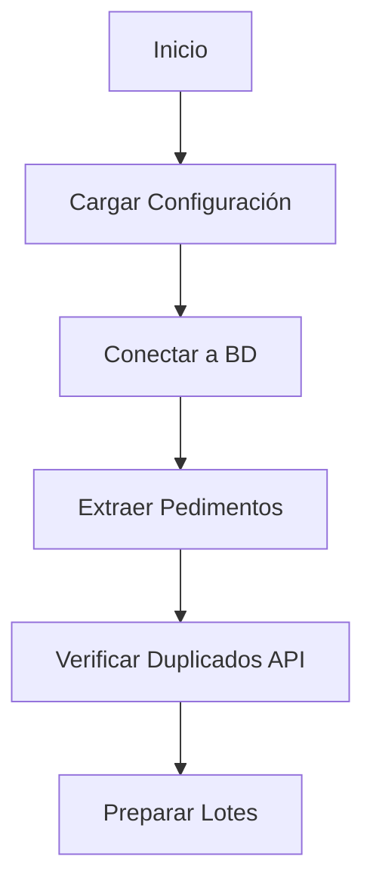

# 📚 Documentación Técnica - Proyecto Migración EFC

## 📋 Índice
1. [Descripción General](#-descripción-general)
2. [Arquitectura del Sistema](#-arquitectura-del-sistema)
3. [Estructura del Proyecto](#-estructura-del-proyecto)
4. [Instalación y Configuración](#-instalación-y-configuración)
5. [Modelos de Datos](#-modelos-de-datos)
6. [API y Controladores](#-api-y-controladores)
7. [Estrategias de Procesamiento](#-estrategias-de-procesamiento)
8. [Flujo de Trabajo](#-flujo-de-trabajo)
9. [Configuración Avanzada](#-configuración-avanzada)
10. [Monitoreo y Logging](#-monitoreo-y-logging)
11. [Solución de Problemas](#-solución-de-problemas)
12. [Ejemplos de Uso](#-ejemplos-de-uso)

---

## 🎯 Descripción General

**Migración EFC** es un sistema robusto de migración de datos diseñado para transferir pedimentos aduanales desde múltiples sistemas legacy hacia una API REST moderna. El proyecto soporta tres tipos de sistemas fuente diferentes y ofrece múltiples estrategias de procesamiento optimizadas para diferentes escenarios de carga.

### ✨ Características Principales

- **🔄 Migración de múltiples sistemas**: SCAII, WINSAII y EXPEDIENTE_VIEJO
- **⚡ Procesamiento optimizado**: Asíncrono, síncrono y multithreaded
- **🛡️ Manejo robusto de errores**: Validación, reintentos y reportes detallados
- **📊 Monitoreo en tiempo real**: Métricas de rendimiento y progreso
- **🚀 Escalabilidad**: Procesamiento en lotes configurables
- **🔍 Detección de duplicados**: Evita envíos redundantes automáticamente

---

## 🏗️ Arquitectura del Sistema

```
┌─────────────────────────────────────────────────────────────┐
│                    MIGRACIÓN EFC                            │
├─────────────────────────────────────────────────────────────┤
│  FUENTES DE DATOS                    │  PROCESAMIENTO       │
│  ┌─────────────┐ ┌─────────────┐    │  ┌─────────────┐     │
│  │   SCAII     │ │  WINSAII    │    │  │  ASÍNCRONO  │     │
│  │ SPedimento  │ │ wPedimento  │    │  │ (aiohttp)   │     │
│  │ GEmpresa    │ │             │    │  └─────────────┘     │
│  └─────────────┘ └─────────────┘    │  ┌─────────────┐     │
│  ┌─────────────┐                    │  │  SÍNCRONO   │     │
│  │EXPEDIENTE   │                    │  │ (requests)  │     │
│  │VIEJO        │                    │  └─────────────┘     │
│  │ Pedimento   │                    │  ┌─────────────┐     │
│  └─────────────┘                    │  │MULTITHREADED│     │
│                                     │  │(ThreadPool) │     │
├─────────────────────────────────────┼──└─────────────┘─────┤
│           BASE DE DATOS             │    API DESTINO       │
│        ┌─────────────┐              │  ┌─────────────┐     │
│        │ SQL Server  │──────────────┼─→│ REST API    │     │
│        │ (pyodbc)    │              │  │ Django/     │     │
│        │ SQLAlchemy  │              │  │ FastAPI     │     │
│        └─────────────┘              │  └─────────────┘     │
└─────────────────────────────────────────────────────────────┘
```

### 🔧 Componentes Principales

1. **Extractores de Datos**: Módulos especializados por cada sistema fuente
2. **Transformadores**: Normalización y mapeo de datos entre esquemas
3. **Procesadores**: Diferentes estrategias de envío a la API
4. **Controladores API**: Interfaz con el sistema destino
5. **Monitor**: Sistema de métricas y reportes

---

## 📁 Estructura del Proyecto

```
Migracion_EFC/
├── 📄 main.py                    # Punto de entrada principal
├── 📄 README_ORM.md              # Documentación SQLAlchemy
├── 📄 .env                       # Variables de entorno
├── 📄 DOCUMENTACION_PROYECTO.md  # Esta documentación
│
├── 📁 config/                    # Configuración del sistema
│   ├── __init__.py
│   ├── db.py                     # Conexiones a base de datos
│   └── settings.py               # Configuración y argumentos CLI
│
├── 📁 controllers/               # Controladores de API
│   ├── __init__.py
│   └── apiController.py          # Cliente HTTP para API destino
│
├── 📁 scaii_models/              # Modelos del sistema SCAII
│   ├── __init__.py
│   ├── sPedimentoModel.py        # Modelo de pedimentos SCAII
│   └── gEmpresaModel.py          # Modelo de empresas SCAII
│
├── 📁 winsaii_models/            # Modelos del sistema WINSAII
│   ├── __init__.py
│   └── wPedimento.py             # Modelo de pedimentos WINSAII
│
└── 📁 expediente_viejo/          # Modelos del sistema legacy
    ├── __init__.py
    └── pedimentos.py             # Modelo de pedimentos legacy
```

---

## 🛠️ Instalación y Configuración

### Prerequisitos

```bash
# Python 3.8+
python --version

# Dependencias del sistema (Windows)
# ODBC Driver 17 for SQL Server
```

### 📦 Dependencias de Python

```bash
# Crear requirements.txt
pip freeze > requirements.txt

# Dependencias principales identificadas:
sqlalchemy>=1.4.0
pyodbc>=4.0.0
aiohttp>=3.8.0
requests>=2.28.0
python-dotenv>=0.19.0
```

### ⚙️ Configuración del Entorno

1. **Crear archivo .env**:
```env
# API Configuration
API_URL=http://localhost:8000/api/v1
API_TOKEN=your_api_token_here

# Database Configuration
DB_USER=sa
DB_PASSWORD=your_password_here
DB_HOST=localhost
DB_PORT=1433
DB_NAME=your_database_name
DB_DRIVER=ODBC Driver 17 for SQL Server
```

2. **Configurar base de datos**:
   - Instalar SQL Server
   - Configurar ODBC Driver 17
   - Crear base de datos con las tablas correspondientes

### 🚀 Instalación

```bash
# 1. Clonar o descargar el proyecto
cd Migracion_EFC

# 2. Crear entorno virtual (recomendado)
python -m venv venv
venv\Scripts\activate  # Windows
# source venv/bin/activate  # Linux/Mac

# 3. Instalar dependencias
pip install -r requirements.txt

# 4. Configurar variables de entorno
# Editar .env con tus credenciales

# 5. Verificar conexión
python -c "from config.db import get_db_session; print('Conexión OK')"
```

---

## 🗃️ Modelos de Datos

### 🔹 Sistema SCAII (app=1)

#### SPedimento
```python
class SPedimento(Base):
    __tablename__ = 'SPedimentos'
    
    PEDIMENTO = Column(String(50), primary_key=True)
    REGIMEN = Column(String(10))
    ADUANA_CRUCE = Column(String(3))
    TIPO = Column(String(1))  # 'I'=Importación, 'E'=Exportación
    CLAVEPED = Column(String(20))
    FECHA_INICIO = Column(DateTime)
    FECHA_FIN = Column(DateTime)
    FECHA_PAGO = Column(DateTime)
```

#### GEmpresa
```python
class GEmpresa(Base):
    __tablename__ = 'GEmpresa'
    
    RFC = Column(String(13), primary_key=True)
    NOMBRE = Column(String(255))
```

### 🔹 Sistema WINSAII (app=2)

#### wPedimento
```python
class wPedimento(Base):
    __tablename__ = 'wPedimento'
    
    PEDIMENTO = Column(String(50), primary_key=True)
    ADUANA = Column(String(3))
    REGIMEN = Column(String(10))
    TIPOPEDIMENTO = Column(String(1))
    CLAVEPED = Column(String(20))
    FECHAINICIO = Column(DateTime)
    FECHAFINAL = Column(DateTime)
    FECHAPAGO = Column(DateTime)
```

### 🔹 Sistema EXPEDIENTE_VIEJO (app=3)

#### Pedimento
```python
class Pedimento(Base):
    __tablename__ = 'pedimentos'
    
    id = Column(Integer, primary_key=True, autoincrement=True)
    patente = Column(String(50))
    pedimento = Column(String(50))
    aduana = Column(String(50))
    operacion = Column(String(1))
    clave = Column(String(50))
    fechapago = Column(Date)
    contribuyente = Column(String(50))
    agente = Column(String(50))
    curpapoderado = Column(String(20))
    importeTotal = Column(Numeric(16, 2))
    saldoDisponible = Column(Numeric(16, 2))
    importePedimento = Column(Numeric(16, 2))
    alerta = Column(Integer, default=1)
    licencia = Column(Integer)
    ExisteExpediente = Column(Boolean, default=False)
```

---

## 🌐 API y Controladores

### APIController

El controlador principal que maneja todas las interacciones con la API destino.

#### Métodos Principales

```python
class APIController:
    def __init__(self):
        self.base_url = API_URL
        self.headers = {
            'Content-Type': 'application/json',
            'Authorization': f'Token {API_TOKEN}'
        }
```

#### Endpoints Disponibles

| Método | Endpoint | Descripción |
|--------|----------|-------------|
| `POST` | `/customs/pedimentos/` | Crear nuevo pedimento |
| `GET` | `/customs/pedimentos/` | Obtener lista de pedimentos |
| `POST` | `/customs/procesamientopedimentos/` | Crear servicio para pedimento |
| `GET` | `/customs/services/{id}/` | Obtener detalles de servicio |

#### Métodos de Procesamiento

1. **Síncrono**: `post_pedimento()`, `post_service()`
2. **Asíncrono**: `post_pedimentos_only_async()`, `post_servicios_only_async()`
3. **Verificación**: `get_existing_pedimentos_numbers()`

---

## ⚡ Estrategias de Procesamiento

### 🚀 1. Procesamiento Asíncrono

**Cuándo usar**: Alto volumen de datos, red estable, máximo rendimiento.

```python
# Configuración optimizada
connector = aiohttp.TCPConnector(limit=200, limit_per_host=50)
batch_size = 500
```

**Características**:
- ✅ Múltiples conexiones simultáneas
- ✅ Procesamiento en dos fases (Pedimentos → Servicios)
- ✅ Control de límites de conexión
- ✅ Manejo asíncrono de errores

**Rendimiento esperado**: 50-100 pedimentos/segundo

### 📝 2. Procesamiento Síncrono

**Cuándo usar**: Red inestable, datos críticos, máxima confiabilidad.

```python
# Procesamiento secuencial con pausas
for pedimento in batch:
    response = api_controller.post_pedimento(pedimento)
    time.sleep(0.1)  # Pausa entre requests
```

**Características**:
- ✅ Una petición a la vez
- ✅ Control granular de errores
- ✅ Menor carga en el servidor
- ✅ Ideal para debugging

**Rendimiento esperado**: 5-15 pedimentos/segundo

### 🧵 3. Procesamiento Multithreaded

**Cuándo usar**: Balance entre rendimiento y estabilidad.

```python
# Pool de hilos configurable
with ThreadPoolExecutor(max_workers=5) as executor:
    futures = {executor.submit(process_pedimento, p): p for p in pedimentos}
```

**Características**:
- ✅ Hilos configurables (1-20)
- ✅ Procesamiento paralelo controlado
- ✅ Estadísticas thread-safe
- ✅ Balance rendimiento/estabilidad

**Rendimiento esperado**: 20-40 pedimentos/segundo

---

## 🔄 Flujo de Trabajo

### Fase de Inicialización



### Proceso Principal

1. **🔍 Extracción de Datos**
   ```python
   # Según tipo de aplicación
   if args.app == 1:  # SCAII
       pedimentos = session.query(SPedimento).all()
   elif args.app == 2:  # WINSAII  
       pedimentos = session.query(wPedimento).all()
   elif args.app == 3:  # EXPEDIENTE_VIEJO
       pedimentos = session.query(Pedimento).filter(
           Pedimento.licencia == 71,
           Pedimento.contribuyente == 'MTK861014317'
       ).limit(100).all()
   ```

2. **🔄 Transformación de Datos**
   ```python
   # Ejemplo transformación fechas numéricas
   def _transform_fecha(self, fecha_numerica):
       if fecha_numerica:
           base_date = datetime(1801, 1, 1)
           return (base_date + timedelta(days=fecha_numerica - 4)).date().isoformat()
       return None
   ```

3. **📤 Envío a API** (Dos Fases)
   - **Fase 1**: Crear pedimentos
   - **Fase 2**: Crear servicios asociados

4. **📊 Reporte de Resultados**

### Transformaciones de Datos

#### Fechas Numéricas → ISO
```python
# SQL Server: DATEADD(DAY, fecha - 4, '1801-01-01')
base_date = datetime(1801, 1, 1)
fecha_iso = (base_date + timedelta(days=fecha_numerica - 4)).date().isoformat()
```

#### Horas Numéricas → Tiempo
```python
# SQL Server: DATEADD(MILLISECOND, (hora - 1) * 10, 0)
milliseconds = (hora_numerica - 1) * 10
total_seconds = milliseconds // 1000
tiempo = datetime.min.replace(
    hour=total_seconds // 3600,
    minute=(total_seconds % 3600) // 60,
    second=total_seconds % 60
).time().isoformat()
```

---

## ⚙️ Configuración Avanzada

### Parámetros de Rendimiento

```python
# Tamaños de lote recomendados por estrategia
BATCH_SIZES = {
    'async': 500,      # Alto rendimiento
    'sync': 50,        # Estabilidad
    'threaded': 200    # Balance
}

# Límites de conexión HTTP
CONNECTOR_LIMITS = {
    'total': 200,      # Total conexiones
    'per_host': 50,    # Por servidor
    'timeout': 10      # Segundos
}
```

### Variables de Entorno

| Variable | Descripción | Valor por Defecto |
|----------|-------------|-------------------|
| `API_URL` | URL base de la API | `http://localhost:8000/api/v1` |
| `API_TOKEN` | Token de autenticación | Requerido |
| `DB_HOST` | Servidor de base de datos | `localhost` |
| `DB_PORT` | Puerto de base de datos | `1433` |
| `DB_NAME` | Nombre de la base de datos | Requerido |
| `DB_USER` | Usuario de base de datos | `sa` |
| `DB_PASSWORD` | Contraseña de base de datos | Requerido |

### Argumentos CLI

```bash
python main.py \
  --db-name DIPRENTA_II \
  --db-url localhost \
  --db-password "mi_password" \
  --app 1
```

| Argumento | Descripción | Valores |
|-----------|-------------|---------|
| `--app` | Tipo de sistema fuente | `1`=SCAII, `2`=WINSAII, `3`=EXPEDIENTE_VIEJO |
| `--db-name` | Nombre de la base de datos | String |
| `--db-url` | URL del servidor de BD | String |
| `--db-password` | Contraseña de la BD | String |

---

## 📊 Monitoreo y Logging

### Métricas Principales

```python
# Reportes automáticos del sistema
MÉTRICAS = {
    'pedimentos_procesados': int,
    'pedimentos_exitosos': int,
    'pedimentos_fallidos': int,
    'servicios_creados': int,
    'servicios_fallidos': int,
    'duplicados_detectados': int,
    'tiempo_total': float,
    'velocidad_promedio': float  # pedimentos/segundo
}
```

### Ejemplo de Reporte

```
=== RESUMEN DE ENVÍO ASÍNCRONO ===
📊 Total pedimentos procesados: 1000
✅ Pedimentos exitosos: 987
❌ Pedimentos fallidos: 13
🔧 Total servicios creados: 987
⏭️  Pedimentos saltados (duplicados): 156
📈 Servicios esperados: 987
📈 Tasa de éxito de servicios: 100.0%
⚡ Velocidad promedio: 67.3 pedimentos/segundo
```

### Logging Detallado

El sistema proporciona logging detallado para debugging:

```python
# Ejemplos de mensajes de log
print(f"✅ Pedimento {pedimento_num} creado exitosamente")
print(f"❌ Error en pedimento {pedimento_num}: {error}")
print(f"⏭️  Saltando pedimento {pedimento_num} (ya existe)")
print(f"🔧 Servicio 3 creado para pedimento {pedimento_num}")
```

---

## 🚨 Solución de Problemas

### Errores Comunes

#### 1. Error de Conexión a Base de Datos
```
Error: [Microsoft][ODBC Driver 17 for SQL Server][SQL Server]Login failed
```

**Solución**:
```python
# Verificar credenciales en .env
DB_USER=sa
DB_PASSWORD=tu_password_correcta
DB_HOST=localhost
DB_PORT=1433

# Verificar conectividad
telnet localhost 1433
```

#### 2. Error de Token API
```
Error: 401 Unauthorized
```

**Solución**:
```python
# Verificar token en .env
API_TOKEN=tu_token_válido

# Verificar headers
headers = {
    'Authorization': f'Token {API_TOKEN}',
    'Content-Type': 'application/json'
}
```

#### 3. Timeout en Requests
```
Error: Request timeout after 10 seconds
```

**Solución**:
```python
# Ajustar timeouts
self.timeout = 30  # Aumentar timeout

# Reducir batch_size
batch_size = 100  # En lugar de 500
```

#### 4. Límite de Conexiones
```
Error: Too many connections
```

**Solución**:
```python
# Reducir límites de conexión
connector = aiohttp.TCPConnector(limit=50, limit_per_host=10)
```

### Debugging

#### Modo Verbose
```python
# Activar logging detallado
import logging
logging.basicConfig(level=logging.DEBUG)
```

#### Verificar Datos
```python
# Verificar transformación de datos
pedimento_body = self._build_scaii_pedimento_body(pedimento)
print(json.dumps(pedimento_body, indent=2))
```

#### Test de Conectividad
```python
# Test básico de API
api_controller = APIController()
response = api_controller.get_pedimentos()
print(f"API Status: {'OK' if response else 'ERROR'}")
```

---

## 📝 Ejemplos de Uso

### Ejemplo 1: Migración SCAII Básica

```bash
# 1. Configurar .env
echo "API_URL=http://mi-api.com/api/v1" > .env
echo "API_TOKEN=mi_token" >> .env
echo "DB_NAME=SCAII_DB" >> .env

# 2. Ejecutar migración
python main.py --db-name SCAII_DB --db-url localhost --db-password "password" --app 1

# 3. Seleccionar estrategia
# Selecciona: 1 (Asíncrono)
```

### Ejemplo 2: Migración EXPEDIENTE_VIEJO con Filtros

```bash
# Migrar solo licencia 71, contribuyente específico, límite 100
python main.py --db-name EXPEDIENTE_DB --db-url servidor --db-password "pass" --app 3

# El sistema automáticamente aplicará filtros:
# - licencia = 71
# - contribuyente = 'MTK861014317'
# - LIMIT 100
```

### Ejemplo 3: Procesamiento Multithreaded Personalizado

```python
# En el prompt del sistema:
# ¿Qué tipo de procesamiento deseas usar?
# Selecciona: 3 (Multithreaded)
# Ingrese el número de hilos: 8

# El sistema configurará automáticamente:
# - 8 hilos de procesamiento paralelo
# - Thread-safe statistics
# - Balance de carga optimizado
```

### Ejemplo 4: Uso Programático

```python
from main import Main
from config.settings import args

# Crear instancia
main_instance = Main()

# Configurar parámetros
batch_size = 300

# Ejecutar según estrategia deseada
if strategy == "async":
    main_instance.process_pedimentos(batch_size)
elif strategy == "sync":
    main_instance.process_pedimentos_sync(batch_size)
elif strategy == "threaded":
    main_instance.process_pedimentos_multithreaded(max_workers=6)
```

---

## 🔮 Roadmap y Mejoras Futuras

### Versión 2.0 - Planificada

- [ ] **Sistema de Colas**: Implementar Redis/RabbitMQ para procesamiento distribuido
- [ ] **Dashboard Web**: Interfaz gráfica para monitoreo en tiempo real
- [ ] **Métricas Avanzadas**: Integración con Prometheus/Grafana
- [ ] **Tests Automatizados**: Suite completa de testing unitario e integración
- [ ] **Configuración YAML**: Reemplazar argumentos CLI con archivos de configuración
- [ ] **Rollback System**: Capacidad de revertir migraciones
- [ ] **Validación de Datos**: Esquemas JSON/Pydantic para validación robusta

### Optimizaciones Técnicas

- [ ] **Connection Pooling**: Pool de conexiones persistentes a BD
- [ ] **Retry Logic**: Reintentos inteligentes con backoff exponencial
- [ ] **Streaming**: Procesamiento de datasets grandes sin cargar en memoria
- [ ] **Caching**: Cache de duplicados para mejor rendimiento
- [ ] **Compression**: Compresión de payloads HTTP

---

## 📄 Licencia y Contribuciones

### Licencia
Este proyecto es de uso interno. Todos los derechos reservados.

### Contribuciones
Para contribuir al proyecto:

1. Fork del repositorio
2. Crear branch para feature (`git checkout -b feature/AmazingFeature`)
3. Commit de cambios (`git commit -m 'Add AmazingFeature'`)
4. Push al branch (`git push origin feature/AmazingFeature`)
5. Crear Pull Request

### Soporte
Para soporte técnico contactar al equipo de desarrollo.

---

## 📞 Contacto y Soporte

- **Desarrollador**: [Tu Nombre]
- **Email**: [tu-email@empresa.com]
- **Documentación**: Este archivo
- **Repositorio**: [URL del repositorio]

---

*Documentación generada automáticamente - Versión 1.0*
*Última actualización: Julio 4, 2025*
